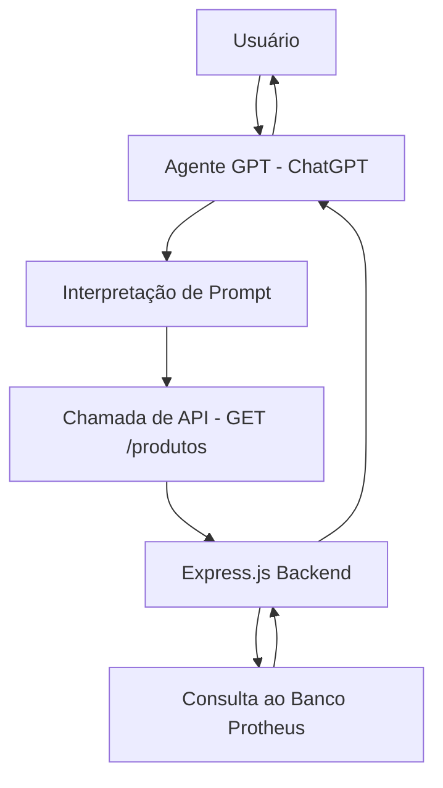

# Documentação Completa – API DELPI

## Índice

-   [Arquitetura do Projeto – Agente GPT com Integração ao Protheus](#arquitetura-do-projeto-agente-gpt-com-integracao-ao-protheus)
    -   [🧱 Visão Geral](#visao-geral)
    -   [🗂️ Componentes da Arquitetura](#componentes-da-arquitetura)
        -   [1. **Frontend (ChatGPT Customizado)**](#1-frontend-chatgpt-customizado)
        -   [2. **Agente GPT (Prompt + Actions)**](#2-agente-gpt-prompt-actions)
        -   [3. **API Express.js (Backend intermediário)**](#3-api-expressjs-backend-intermediario)
        -   [4. **Banco de Dados Protheus**](#4-banco-de-dados-protheus)
    -   [🔄 Fluxo de Comunicação](#fluxo-de-comunicacao)
    -   [🔐 Segurança](#seguranca)
    -   [📈 Escalabilidade e Futuro](#escalabilidade-e-futuro)
    -   [📁 Estrutura de Pastas (Backend)](#estrutura-de-pastas-backend)
    -   [✅ Tecnologias Utilizadas](#tecnologias-utilizadas)
-   [app.js — Documentação Técnica (Bootstrap da API)](#appjs-documentacao-tecnica-bootstrap-da-api)
    -   [Objetivo](#objetivo)
    -   [Visão Geral](#visao-geral-2)
    -   [Endpoints Globais (com prefixos)](#endpoints-globais-com-prefixos)
    -   [Middlewares](#middlewares)
    -   [Variáveis de Ambiente](#variaveis-de-ambiente)
-   [Outras: DB_USER, DB_PASSWORD, DB_HOST, DB_DATABASE, DB_PORT (ver db.md)](#outras-dbuser-dbpassword-dbhost-dbdatabase-dbport-ver-dbmd)
    -   [Exemplos de Requisição](#exemplos-de-requisicao)
-   [Healthcheck](#healthcheck)
-   [Produtos](#produtos)
-   [Sistema](#sistema)
    -   [Observabilidade e Segurança (Recomendado)](#observabilidade-e-seguranca-recomendado)
    -   [Erros e Respostas](#erros-e-respostas)
    -   [Execução Local](#execucao-local)
-   [API em: http://localhost:${PORT:-3000}](#api-em-httplocalhostport-3000)
    -   [Próximos Passos](#proximos-passos)
-   [Conexão com SQL Server (`db.js`) — Documentação Técnica](#conexao-com-sql-server-dbjs-documentacao-tecnica)
    -   [Objetivo](#objetivo-2)
    -   [Implementação (resumo)](#implementacao-resumo)
    -   [Variáveis de Ambiente (.env)](#variaveis-de-ambiente-env)
    -   [Parâmetros Importantes](#parametros-importantes)
    -   [Uso](#uso)
    -   [Tratamento e Observabilidade](#tratamento-e-observabilidade)
    -   [Troubleshooting Rápido](#troubleshooting-rapido)
    -   [Boas Práticas](#boas-praticas)
    -   [Testes Sugeridos](#testes-sugeridos)
    -   [Extensões Futuras](#extensoes-futuras)
-   [BaseRepository — Documentação Técnica](#baserepository-documentacao-tecnica)
    -   [Objetivo](#objetivo-3)
    -   [Visão Geral da Implementação](#visao-geral-da-implementacao)
    -   [API Pública](#api-publica)
        -   [`async getAll(table, columnsArray = ["*"], options = {})`](#async-getalltable-columnsarray-options)
        -   [`async getByValue(table, columnsArray = ["*"], keyValue, keyColumn = "id")`](#async-getbyvaluetable-columnsarray-keyvalue-keycolumn-id)
    -   [Segurança Contra Injeção](#seguranca-contra-injecao)
    -   [Tratamento de Erros](#tratamento-de-erros)
    -   [Requisitos/Dependências](#requisitosdependencias)
    -   [Testes Sugeridos](#testes-sugeridos-2)
    -   [Extensões Futuras (Roadmap)](#extensoes-futuras-roadmap)
    -   [Snippets Úteis](#snippets-uteis)
-   [ProductRepository — Documentação Técnica](#productrepository-documentacao-tecnica)
    -   [Objetivo](#objetivo-4)
    -   [API Pública](#api-publica-2)
        -   [`async getAllProducts(pagina = 1)`](#async-getallproductspagina-1)
        -   [`async getProductByGroup(group)`](#async-getproductbygroupgroup)
        -   [`async getProductByCode(code)`](#async-getproductbycodecode)
        -   [`async getRecursiveStructure(code, visited = new Set())`](#async-getrecursivestructurecode-visited-new-set)
    -   [Exemplos de Uso](#exemplos-de-uso)
    -   [Segurança e Boas Práticas](#seguranca-e-boas-praticas)
    -   [Testes Recomendados](#testes-recomendados)
    -   [Roadmap / Melhorias](#roadmap-melhorias)
-   [SystemRepository — Documentação Técnica](#systemrepository-documentacao-tecnica)
    -   [Objetivo](#objetivo-5)
    -   [API Pública](#api-publica-3)
        -   [`async getAllTables()`](#async-getalltables)
        -   [`async getColumnsTable(tableName)`](#async-getcolumnstabletablename)
    -   [Exemplos de Uso](#exemplos-de-uso-2)
    -   [Integração (Controller/Rotas) — Exemplo](#integracao-controllerrotas-exemplo)
    -   [Considerações e Boas Práticas](#consideracoes-e-boas-praticas)
    -   [Testes Recomendados](#testes-recomendados-2)
    -   [Possíveis Extensões](#possiveis-extensoes)
-   [productRoutes — Documentação Técnica (Express Router)](#productroutes-documentacao-tecnica-express-router)
    -   [Objetivo](#objetivo-6)
    -   [Sumário de Endpoints](#sumario-de-endpoints)
    -   [Detalhamento](#detalhamento)
        -   [1) `GET /`](#1-get)
        -   [2) `GET /code=:code`](#2-get-codecode)
        -   [3) `GET /group=:group`](#3-get-groupgroup)
    -   [Exemplos de Requisição (assumindo prefixo `/products`)](#exemplos-de-requisicao-assumindo-prefixo-products)
        -   [Listar produtos](#listar-produtos)
        -   [Obter produto + estrutura por código](#obter-produto-estrutura-por-codigo)
        -   [Listar por grupo](#listar-por-grupo)
    -   [Tratamento de Erros](#tratamento-de-erros-2)
    -   [Segurança](#seguranca-2)
    -   [OpenAPI (trechos)](#openapi-trechos)
    -   [Melhorias Recomendadas](#melhorias-recomendadas)
-   [systemRoutes — Documentação Técnica (Express Router)](#systemroutes-documentacao-tecnica-express-router)
    -   [Objetivo](#objetivo-7)
    -   [Sumário de Endpoints](#sumario-de-endpoints-2)
    -   [1) `GET /tables`](#1-get-tables)
    -   [2) `GET /tables/:tablename/columns/`](#2-get-tablestablenamecolumns)
    -   [Exemplos de Requisição (assumindo prefixo `/system`)](#exemplos-de-requisicao-assumindo-prefixo-system)
        -   [Listar tabelas](#listar-tabelas)
        -   [Listar colunas de uma tabela](#listar-colunas-de-uma-tabela)
    -   [Tratamento de Erros](#tratamento-de-erros-3)
    -   [Segurança](#seguranca-3)
    -   [OpenAPI (trechos)](#openapi-trechos-2)
    -   [Melhorias Recomendadas](#melhorias-recomendadas-2)

<!-- Início de: README.md -->

# Arquitetura do Projeto – Agente GPT com Integração ao Protheus

<a id="arquitetura-do-projeto-agente-gpt-com-integracao-ao-protheus"></a>

## 🧱 Visão Geral

<a id="visao-geral"></a>

Este projeto tem como objetivo criar um agente GPT personalizado que:

-   Consulta dados do Protheus por meio de uma API Node.js/Express.js com acesso de leitura
-   Auxilia usuários na criação de produtos conforme normas internas
-   Gera estruturas de dados formatadas para posterior inclusão via API REST

---

## 🗂️ Componentes da Arquitetura

<a id="componentes-da-arquitetura"></a>

### 1. **Frontend (ChatGPT Customizado)**

<a id="1-frontend-chatgpt-customizado"></a>

-   Interface: ChatGPT com agente criado no [GPTs Builder](https://chat.openai.com/gpts)
-   Comunicação via linguagem natural
-   Instruções detalhadas para interpretar e transformar perguntas em ações

### 2. **Agente GPT (Prompt + Actions)**

<a id="2-agente-gpt-prompt-actions"></a>

-   **Prompt personalizado** com contexto de Protheus e regras de cadastro
-   **Integração com API externa** usando OpenAPI (Swagger)
-   Interpretação semântica das solicitações + resposta estruturada

### 3. **API Express.js (Backend intermediário)**

<a id="3-api-expressjs-backend-intermediario"></a>

-   Desenvolvida em Node.js com Express
-   Responsável por acessar as tabelas do banco do Protheus (somente leitura)
-   Endpoints RESTful expostos:
    -   `GET /produtos`
    -   `GET /produtos/:cod`
    -   `GET /produtos?desc=...`
    -   `GET /produtos/ultimo`

### 4. **Banco de Dados Protheus**

<a id="4-banco-de-dados-protheus"></a>

-   Acesso com usuário de leitura
-   Fonte dos dados consultados pelo agente GPT via API
-   Tabelas envolvidas:
    -   `SB1` – Produtos
    -   `SA1` – Clientes
    -   `SC5`/`SC6` – Pedidos de Venda
    -   `SD1`/`SD2` – Estoque/Movimentações

---

## 🔄 Fluxo de Comunicação

<a id="fluxo-de-comunicacao"></a>



---

## 🔐 Segurança

<a id="seguranca"></a>

-   API protegida por `x-api-key` ou token JWT
-   Permissões de leitura no banco
-   Logs de acesso à API para rastreamento

---

## 📈 Escalabilidade e Futuro

<a id="escalabilidade-e-futuro"></a>

-   Substituir API Express por REST nativo do Protheus
-   Habilitar escrita (POST/PUT) assim que autorizado
-   Conectar o JSON gerado pelo GPT diretamente com rotinas do Protheus

---

## 📁 Estrutura de Pastas (Backend)

<a id="estrutura-de-pastas-backend"></a>

```
/protheus-agent-api
├── app.js
├── routes
│   └── produtos.js
├── controllers
│   └── produtosController.js
├── services
│   └── protheusService.js
├── utils
├── config
└── docs (OpenAPI)
```

---

## ✅ Tecnologias Utilizadas

<a id="tecnologias-utilizadas"></a>

-   Node.js + Express
-   PostgreSQL/ODBC (ou conexão compatível com banco Protheus)
-   OpenAI GPT-4
-   Swagger (OpenAPI) para documentação da API

---

<!-- Fim de: README.md -->

---

<!-- Início de: app.md -->

# app.js — Documentação Técnica (Bootstrap da API)

<a id="appjs-documentacao-tecnica-bootstrap-da-api"></a>

> **Arquivo fonte:** `app.js`  
> **Stack:** Node.js + Express + CORS + dotenv

---

## Objetivo

<a id="objetivo"></a>

Inicializar o servidor HTTP, aplicar **middlewares globais**, montar os **routers** de sistema/usuários/produtos com seus **prefixos** e expor um **healthcheck** simples.

---

## Visão Geral

<a id="visao-geral-2"></a>

```js
import "dotenv/config";
import express from "express";
import cors from "cors";
import systemRouter from "./routes/systemRoutes.js";
import productRouter from "./routes/productRoutes.js";
const app = express();

app.use(express.json());
app.use(cors());

app.use("/api/system", systemRouter);
app.use("/api/products", productRouter);
app.get("/health", (req, res) => {
    res.send("API DELPI online e saudável!");
});

const PORT = process.env.PORT || 3000;
app.listen(PORT, () =>
    console.log(`API de DELPI está online em http://localhost:${PORT}`)
);
```

---

## Endpoints Globais (com prefixos)

<a id="endpoints-globais-com-prefixos"></a>

| Recurso     | Prefixo Base    | Router             | Observações                        |
| ----------- | --------------- | ------------------ | ---------------------------------- |
| Sistema     | `/api/system`   | `systemRoutes.js`  | Inspeção do catálogo do SQL Server |
| Produtos    | `/api/products` | `productRoutes.js` | Consulta de produtos e estrutura   |
| Healthcheck | `/health`       | inline (express)   | Retorna `200 OK` com texto simples |

> **Dica:** se publicar atrás de um gateway/proxy, mantenha o `basePath` coerente com a documentação OpenAPI.

---

## Middlewares

<a id="middlewares"></a>

-   `express.json()` — parse do corpo JSON.
-   `cors()` — habilita CORS **para qualquer origem** (padrão).
    -   **Produção**: restrinja com `cors({ origin: ["https://seu-dominio"] })` e adicione `credentials` se necessário.

---

## Variáveis de Ambiente

<a id="variaveis-de-ambiente"></a>

```dotenv
PORT=3000
# Outras: DB_USER, DB_PASSWORD, DB_HOST, DB_DATABASE, DB_PORT (ver db.md)
<a id="outras-dbuser-dbpassword-dbhost-dbdatabase-dbport-ver-dbmd"></a>
```

-   Quando `PORT` não é definido, usa `3000`.

---

## Exemplos de Requisição

<a id="exemplos-de-requisicao"></a>

```bash
# Healthcheck
<a id="healthcheck"></a>
curl -i http://localhost:3000/health

# Produtos
<a id="produtos"></a>
curl -s http://localhost:3000/api/products
curl -s http://localhost:3000/api/products/code=10080001
curl -s http://localhost:3000/api/products/group=1008

# Sistema
<a id="sistema"></a>
curl -s http://localhost:3000/api/system/tables
curl -s http://localhost:3000/api/system/tables/SB1010/columns/
```

---

## Observabilidade e Segurança (Recomendado)

<a id="observabilidade-e-seguranca-recomendado"></a>

-   **Logs estruturados** (pino/winston) + correlação (`X-Request-Id`).
-   **Helmet** para _security headers_: `app.use(helmet())`.
-   **Rate limiting** (ex.: `express-rate-limit`) por IP/chave.
-   **Auth** (API Key/JWT) via middleware antes dos routers:
    ```js
    app.use(authMiddleware); // aplica a /api/**
    ```
-   **CORS restrito** em produção.
-   **HTTPS** obrigatório no frontdoor (proxy/reverso).

---

## Erros e Respostas

<a id="erros-e-respostas"></a>

-   Cada rota já possui `try/catch` local e responde `500` no erro.
-   Sugestão: middleware global de **tratamento de erros** para padronizar payloads:
    ```js
    app.use((err, req, res, next) => {
        console.error(err);
        res.status(err.statusCode || 500).json({
            code: err.code || "INTERNAL_ERROR",
            message: err.message || "Erro inesperado",
        });
    });
    ```

---

## Execução Local

<a id="execucao-local"></a>

```bash
npm install
npm run start        # ou: node app.js / nodemon
# API em: http://localhost:${PORT:-3000}
<a id="api-em-httplocalhostport-3000"></a>
```

---

## Próximos Passos

<a id="proximos-passos"></a>

1. Publicar **OpenAPI** (Swagger UI) em `/api/docs` servindo `docs/openapi.yaml`.
2. Padronizar **erros** e **auth** em `/api/**`.
3. Adicionar **paginação** e **ordenação** configuráveis às rotas de produtos.

<!-- Fim de: app.md -->

---

<!-- Início de: db.md -->

# Conexão com SQL Server (`db.js`) — Documentação Técnica

<a id="conexao-com-sql-server-dbjs-documentacao-tecnica"></a>

> **Arquivo fonte:** `repository/db.js`  
> **Stack:** Node.js + [`mssql`](https://www.npmjs.com/package/mssql) + variáveis de ambiente (`dotenv`)

---

## Objetivo

<a id="objetivo-2"></a>
Prover uma **conexão global** (singleton) ao SQL Server via _connection pool_, exposta como `poolPromise` para ser reutilizada pelos repositórios (`BaseRepository`, `ProductRepository`, `SystemRepository`, etc.).

---

## Implementação (resumo)

<a id="implementacao-resumo"></a>

```js
import sql from "mssql";
import dotenv from "dotenv";

dotenv.config();

const dbConfig = {
    user: process.env.DB_USER,
    password: process.env.DB_PASSWORD,
    server: process.env.DB_HOST,
    database: process.env.DB_DATABASE,
    port: parseInt(process.env.DB_PORT) || 1433,
    options: {
        encrypt: false, // true para Azure
        trustServerCertificate: true, // true em redes locais / certificados self-signed
    },
    pool: { max: 10, min: 0, idleTimeoutMillis: 30000 },
};

const poolPromise = sql
    .connect(dbConfig)
    .then((pool) => {
        console.log("Conectado ao SQL Server com sucesso!");
        return pool;
    })
    .catch((err) => {
        console.error("Erro ao conectar no SQL Server:", err);
        throw err;
    });

export default poolPromise;
```

---

## Variáveis de Ambiente (.env)

<a id="variaveis-de-ambiente-env"></a>

```dotenv
DB_USER=usuario
DB_PASSWORD=senha_forte
DB_HOST=servidor_ou_ip
DB_DATABASE=nome_do_banco
DB_PORT=1433
```

**Notas**

-   **Nunca** comitar `.env` no repositório.
-   Usuário com **privilégios mínimos** necessários (preferir _read-only_ para consultas).

---

## Parâmetros Importantes

<a id="parametros-importantes"></a>

-   `options.encrypt`:
    -   `true` (recomendado para **Azure** / ambientes com TLS).
    -   `false` em redes locais sem TLS configurado.
-   `options.trustServerCertificate`:
    -   `true` quando for usar certificado **self-signed** (dev/lan).
    -   `false` em produção com certificado válido.
-   `pool`:
    -   `max`: conexões máximas simultâneas (ajuste conforme carga).
    -   `idleTimeoutMillis`: tempo para reciclagem de conexões inativas.
-   `port`: padrão `1433`.

---

## Uso

<a id="uso"></a>

```js
// Em qualquer repositório ou service
import poolPromise from "./db.js";

export async function exemplo() {
    const pool = await poolPromise;
    const result = await pool
        .request()
        .input("status", "ATIVO")
        .query("SELECT TOP (10) * FROM SB1010 WHERE B1_ATIVO = @status");
    return result.recordset;
}
```

---

## Tratamento e Observabilidade

<a id="tratamento-e-observabilidade"></a>

-   **Logs** no sucesso/erro de conexão (stdout).  
    Em produção, integrar com o logger da aplicação (ex.: pino/winston) e mascarar segredos.
-   Em caso de falhas, o `catch` **propaga** o erro (`throw`). Garanta _retry/backoff_ no **nível da aplicação/infra** (ex.: orquestrador reinicia o processo).

---

## Troubleshooting Rápido

<a id="troubleshooting-rapido"></a>

-   **`ELOGIN` / `Login failed`**: usuário/senha/banco inválidos ou permissão insuficiente.
-   **`ESOCKET` / timeouts**: firewall/porta; checar `DB_HOST`, `DB_PORT`, VPN; TLS mal configurado.
-   **`Failed to connect`** em Azure: definir `options.encrypt = true` e `trustServerCertificate = false` (ou cert válido).
-   **Caracteres inválidos no host**: usar apenas hostname/IP; sem `http://`.

---

## Boas Práticas

<a id="boas-praticas"></a>

-   Mantenha **uma única instância** do pool por processo (modelo atual).
-   Encapsule queries em repositórios e **sempre** use **parâmetros** (`request.input`) para evitar injeção.
-   Configure **healthcheck** simples para readiness/liveness (ex.: `SELECT 1` no startup/intervalos).
-   Rotacione senhas com frequência e use **secret manager** quando possível.

---

## Testes Sugeridos

<a id="testes-sugeridos"></a>

1. **Conexão**: variáveis válidas → `poolPromise` resolve e executa `SELECT 1`.
2. **Erro de credencial**: garantir propagação do erro (teste unitário com env inválida).
3. **TLS**: simular `encrypt=true` em ambiente com/sem certificado confiável.
4. **Pool**: múltiplas requisições paralelas não devem criar múltiplas conexões fora do limite (ver métricas).

---

## Extensões Futuras

<a id="extensoes-futuras"></a>

-   Suporte a **Failover Partner** / **MultiSubnetFailover** (AlwaysOn).
-   Expor métricas de pool (abertas/ativas) para Prometheus.
-   Leitura/escrita separada (read replicas) com _routing_ por tipo de carga.

<!-- Fim de: db.md -->

---

<!-- Início de: BaseRepository.md -->

# BaseRepository — Documentação Técnica

<a id="baserepository-documentacao-tecnica"></a>

> **Arquivo fonte:** `repository/BaseRepository.js`  
> **Stack:** Node.js, `mssql` (SQL Server), Pool de conexões via `db.js`

## Objetivo

<a id="objetivo-3"></a>

Fornecer um repositório genérico e seguro para **consultas de leitura** com:

-   Seleção de colunas (projeção);
-   Filtros dinâmicos parametrizados;
-   Ordenação com proteção contra injeção (ORDER BY “seguro”);
-   Paginação com `OFFSET ... FETCH NEXT`.

Inclui a função utilitária `sanitizeIdentifier` para validar **identificadores** (nomes de tabela/coluna).

---

## Visão Geral da Implementação

<a id="visao-geral-da-implementacao"></a>

```js
import poolPromise from "./db.js";
import sql from "mssql";

function sanitizeIdentifier(identifier) {
    if (!/^[A-Za-z0-9_]+$/.test(identifier)) {
        throw new Error(`Identificador inválido: ${identifier}`);
    }
    return identifier;
}

class BaseRepository {
    async getAll(table, columnsArray = ["*"], options = {}) {
        /* ... */
    }
    async getByValue(table, columnsArray = ["*"], keyValue, keyColumn = "id") {
        /* ... */
    }
}

export default BaseRepository;
```

---

## API Pública

<a id="api-publica"></a>

### `async getAll(table, columnsArray = ["*"], options = {})`

<a id="async-getalltable-columnsarray-options"></a>

Retorna um **array de registros** (`result.recordset`) a partir de uma tabela, com filtros, ordenação e paginação opcionais.

**Parâmetros**

-   `table: string` — Nome da tabela (ex.: `"SB1010"` ou `"Produtos"`).  
    Validado por `sanitizeIdentifier`.
-   `columnsArray?: string[]` — Lista de colunas ou `["*"]`.  
    Cada coluna é validada por `sanitizeIdentifier`. Quando `["*"]`, todas as colunas são selecionadas.
-   `options?: { filters?: Record<string, any>, page?: number, limit?: number, orderBy?: string }`
    -   `filters` (opcional): objeto `chave -> valor` para cláusulas `WHERE` com **igualdade**.  
        Ex.: `{ status: "ATIVO", grupo: "CABOS" }` → `WHERE status = @param_status AND grupo = @param_grupo`.
    -   `orderBy` (opcional): nome da coluna para `ORDER BY` (validado).
    -   `page` (opcional): número da página (>= 1). **Obrigatório** quando `limit` for informado.
    -   `limit` (opcional): tamanho da página (> 0).

**Comportamento**

1. **Sanitização** de `table`, `columnsArray` e `orderBy` usando `sanitizeIdentifier` (somente letras, números e `_`).
2. **SELECT** montado com projeção segura: `"*"` ou `col1, col2, ...`.
3. **WHERE dinâmico**: cada filtro vira `coluna = @param_coluna` (parametrizado via `request.input(...)`).
4. **ORDER BY seguro**:
    - se `orderBy` informado → usa a coluna sanitizada;
    - senão, **fallback**:
        - se projeção é `"*"` → usa a **primeira chave de `filters`** ou o literal `1` (equivale a ordenar pela primeira coluna do `SELECT`);
        - se projeção por lista → usa a **primeira coluna** da lista.
5. **Paginação**: quando `limit > 0`, aplica
    ```sql
    ORDER BY <safeOrderBy> OFFSET <offset> ROWS FETCH NEXT <limit> ROWS ONLY
    ```
    com `offset = (page - 1) * limit`.
6. **Retorno**: `Promise<Array<any>>` — conteúdo de `result.recordset`.

**Observações e Pontos de Atenção**

-   Se `limit` for definido **sem** `page`, `offset` vira `NaN` (erro de SQL).  
    ➤ **Regra prática**: sempre informe `page` quando usar `limit`.
-   O fallback `ORDER BY 1` é suportado no SQL Server (ordena pelo **1º item do SELECT**), mas pode gerar resultados **instáveis** quando a projeção muda. Prefira **sempre** informar `orderBy` explicitamente.
-   `filters` implementa **apenas igualdade**. Para `LIKE`, intervalos (`BETWEEN`), listas (`IN`), etc., será necessário estender o método.
-   Identificadores com caracteres especiais (espaços, hífens, colchetes) **não** são aceitos por `sanitizeIdentifier`. Caso existam nomes assim no banco, considere mapear aliases seguros no código.
-   Paginação por `OFFSET` pode ter custo alto com offsets grandes. Para alta escala, avalie **keyset pagination** (cursor baseado em coluna ordenada e última chave).

**Exemplos**

```js
// 1) Listar produtos ativos, página 2, 50 por página, ordenando por codigo
const repo = new BaseRepository();
const produtos = await repo.getAll(
    "SB1010",
    ["B1_COD", "B1_DESC", "B1_TIPO", "B1_ATIVO"],
    {
        filters: { B1_ATIVO: "1" },
        page: 2,
        limit: 50,
        orderBy: "B1_COD",
    }
);
// produtos -> Array de linhas
```

```js
// 2) Buscar sem paginação, com projeção total e fallback de ordenação
const linhas = await repo.getAll("SB1010", ["*"], {
    filters: { B1_ATIVO: "1" },
});
```

---

### `async getByValue(table, columnsArray = ["*"], keyValue, keyColumn = "id")`

<a id="async-getbyvaluetable-columnsarray-keyvalue-keycolumn-id"></a>

Obtém registros que correspondem a um **valor específico** na coluna-chave.

**Parâmetros**

-   `table: string` — Tabela (sanitizada).
-   `columnsArray?: string[]` — Projeção (`"*"` ou lista de colunas sanitizadas).
-   `keyValue: any` — Valor a ser buscado (parametrizado como `@id`).
-   `keyColumn?: string` — Coluna da chave (default: `"id"`, sanitizada).

**Comportamento**

1. Sanitiza `table`, `columnsArray` e `keyColumn`.
2. Monta:
    ```sql
    SELECT <cols> FROM <table> WHERE <keyColumn> = @id
    ```
3. Preenche `@id` via `request.input("id", keyValue)` e executa.
4. Retorna `result.recordset` (pode vir **vazio**; não impõe unicidade).

**Exemplos**

```js
// 1) Buscar produto por código
const produto = await repo.getByValue(
    "SB1010",
    ["B1_COD", "B1_DESC", "B1_UM", "B1_TIPO"],
    "DL000123",
    "B1_COD"
);

// 2) Buscar cliente por CNPJ
const cliente = await repo.getByValue(
    "SA1010",
    ["A1_COD", "A1_LOJA", "A1_NOME", "A1_CGC"],
    "12.345.678/0001-90",
    "A1_CGC"
);
```

---

## Segurança Contra Injeção

<a id="seguranca-contra-injecao"></a>

-   **Identificadores** (tabelas/colunas): verificados por `sanitizeIdentifier` (regex `^[A-Za-z0-9_]+$`).  
    Qualquer outro caractere dispara erro e **bloqueia injeção** via nomes.
-   **Valores**: sempre **parametrizados** pelo driver `mssql` (`request.input(...)`), evitando concatenação direta.

---

## Tratamento de Erros

<a id="tratamento-de-erros"></a>

-   Os métodos fazem `throw` do erro capturado (`catch { throw error; }`).  
    ➤ Consuma o repositório em camadas superiores (services/controllers) com `try/catch` e **padronize** respostas HTTP (ex.: `500` com `code/message`).

**Exemplo (controller):**

```js
try {
    const data = await repo.getAll("SB1010", ["*"], {
        page: 1,
        limit: 50,
        orderBy: "B1_COD",
    });
    res.json(data);
} catch (err) {
    req.log?.error?.(err); // ou console.error
    res.status(500).json({
        code: "INTERNAL_ERROR",
        message: "Erro inesperado",
    });
}
```

---

## Requisitos/Dependências

<a id="requisitosdependencias"></a>

-   Conexão via `poolPromise` (exportada por `db.js`).
-   Pacote `mssql` corretamente configurado (string de conexão, pool, etc.).

---

## Testes Sugeridos

<a id="testes-sugeridos-2"></a>

1. **Sanitização de identificadores**
    - Aceita: `SB1010`, `B1_DESC`, `A1_CGC`, `X123_ABC`
    - Rejeita: `SB1-010`, `B1.DESC`, `B1 DESC`, `B1]DESC`, `DROP_TABLE`
2. **Filtros parametrizados** — confere se cria `@param_*` e não concatena valores na string SQL.
3. **Paginação**
    - `limit` + `page` válidos → gera `OFFSET`/`FETCH` corretos.
    - `limit` sem `page` → garantir validação em camada superior (evitar `NaN`).
4. **Ordenação**
    - `orderBy` válido → respeitado.
    - Sem `orderBy` → fallback esperado.
5. **Retorno**
    - `recordset` vazio quando não há correspondência.
    - Com projeção `"*"` e com lista de colunas.

---

## Extensões Futuras (Roadmap)

<a id="extensoes-futuras-roadmap"></a>

-   Suporte a operadores (`LIKE`, `IN`, `BETWEEN`, `>=`, etc.) com **builder** seguro.
-   Keyset pagination para grandes volumes.
-   Whitelist de tabelas/colunas por contexto (ex.: somente schemas SB1/SA1/SC\*).
-   Cache leve (ex.: `memory-cache`/Redis) para consultas muito repetidas.

---

## Snippets Úteis

<a id="snippets-uteis"></a>

**Construção de filtros externos (service):**

```js
const { page = 1, limit = 50, orderBy = "B1_COD", ...rawFilters } = req.query;
const filters = {};
if (rawFilters.status) filters.B1_ATIVO = rawFilters.status;
if (rawFilters.grupo) filters.B1_GRUPO = rawFilters.grupo;

const items = await repo.getAll(
    "SB1010",
    ["B1_COD", "B1_DESC", "B1_UM", "B1_TIPO"],
    {
        filters,
        page: Number(page),
        limit: Number(limit),
        orderBy,
    }
);
```

---

**Resumo**

-   **Use `orderBy` explícito** sempre que possível.
-   **Informe `page` quando usar `limit`**.
-   **Evite nomes não convencionais** de tabela/coluna (apenas `[A-Za-z0-9_]`).

```text
Retorno: Promise<Array<any>> (mssql.recordset)
```

<!-- Fim de: BaseRepository.md -->

---

<!-- Início de: ProductRepository.md -->

# ProductRepository — Documentação Técnica

<a id="productrepository-documentacao-tecnica"></a>

> **Arquivo fonte:** `repository/ProductRepository.js`  
> **Depende de:** `repository/BaseRepository.js` (métodos `getAll` e `getByValue`)  
> **Tabelas Protheus:**
>
> -   `SB1010` (Produtos) — colunas usadas: `B1_GRUPO`, `B1_COD`, `B1_DESC`, `B1_TIPO`
> -   `SG1010` (Estrutura/BOM) — colunas usadas: `G1_COD`, `G1_COMP`, `G1_OBSERV`

## Objetivo

<a id="objetivo-4"></a>
Fornecer consultas especializadas para **produtos** e sua **estrutura** (BOM) a partir das tabelas do Protheus, reutilizando as proteções de sanitização e parametrização já presentes no `BaseRepository`.

---

## API Pública

<a id="api-publica-2"></a>

### `async getAllProducts(pagina = 1)`

<a id="async-getallproductspagina-1"></a>
Retorna a lista de produtos da `SB1010` com as colunas `B1_GRUPO`, `B1_COD`, `B1_DESC`, `B1_TIPO`, **ordenada por `B1_COD`**.

-   **Parâmetros**
    -   `pagina` (opcional, _não utilizado atualmente_): valor padrão `1`. O método não envia `page/limit` para o `BaseRepository`, portanto **não há paginação** nesta consulta.
-   **SQL gerada (conceitual)**
    ```sql
    SELECT B1_GRUPO, B1_COD, B1_DESC, B1_TIPO
    FROM SB1010
    ORDER BY B1_COD
    ```
-   **Retorno**
    -   `Promise<Array<{ B1_GRUPO, B1_COD, B1_DESC, B1_TIPO }>>`

> **Observação:** Para datasets grandes, recomenda-se evoluir este método para receber `page` e `limit` e repassar ao `BaseRepository`.

---

### `async getProductByGroup(group)`

<a id="async-getproductbygroupgroup"></a>
Filtra produtos por **grupo** (`B1_GRUPO = group`) retornando `B1_COD`, `B1_GRUPO`, `B1_DESC`.

-   **Parâmetros**
    -   `group: string` — valor exato do grupo.
-   **SQL gerada (conceitual)**
    ```sql
    SELECT B1_COD, B1_GRUPO, B1_DESC
    FROM SB1010
    WHERE B1_GRUPO = @param_B1_GRUPO
    ORDER BY B1_COD -- fallback do BaseRepository (1ª coluna projetada)
    ```
-   **Retorno**
    -   `Promise<Array<{ B1_COD, B1_GRUPO, B1_DESC }>>`

---

### `async getProductByCode(code)`

<a id="async-getproductbycodecode"></a>
Busca um **produto pelo código** (`B1_COD = code`) e acrescenta a **estrutura recursiva** via `getRecursiveStructure` no campo `structureProduct`.

-   **Parâmetros**
    -   `code: string` — código do produto (ex.: `"DL000123"`).
-   **Fluxo**
    1. `getByValue("SB1010", ["B1_COD","B1_DESC","B1_GRUPO"], code, "B1_COD")`  
       → retorna `recordset` e usa o **primeiro item** como `product`.
    2. Enriquecimento: `structureProduct = await getRecursiveStructure(product.B1_COD)`.
    3. Retorno do objeto final com _spread_ de `product`.
-   **Contrato de retorno (exemplo)**
    ```json
    {
        "B1_COD": "DL000123",
        "B1_DESC": "Conector ABC 2 vias",
        "B1_GRUPO": "CONEXOES",
        "structureProduct": [
            /* árvore de componentes */
        ]
    }
    ```
-   **Pontos de atenção**
    -   Se o código **não existir**, `search[0]` será `undefined` e o operador spread (`{ ...product }`) lançará erro.  
        ➤ Sugestão (futuro): validar e retornar `null` ou lançar erro domado do domínio (ex.: `ProdutoNaoEncontrado`).

---

### `async getRecursiveStructure(code, visited = new Set())`

<a id="async-getrecursivestructurecode-visited-new-set"></a>
Realiza **busca recursiva** de estrutura a partir de um código, protegendo contra ciclos com o conjunto `visited`.

-   **Parâmetros**
    -   `code: string` — código de referência para a etapa atual.
    -   `visited: Set<string>` — conjunto de códigos já visitados para **evitar loops**.
-   **Implementação**
    1. Se `visited` já contém `code`, retorna `[]` (para impedir referência cíclica infinita).
    2. Marca `code` como visitado.
    3. Busca componentes relacionados na `SG1010` por **igualdade**:
        ```js
        super.getByValue(
            "SG1010",
            ["G1_COD", "G1_COMP", "G1_OBSERV"],
            code,
            "G1_COMP"
        );
        ```
    4. Para cada componente encontrado, chama recursivamente `getRecursiveStructure(component.G1_COD, visited)` em **paralelo** via `Promise.all`, montando a propriedade `subStructure`.
-   **Retorno (forma)**
    ```ts
    type Node = {
        G1_COD: string; // código "pai" ou referência de estrutura
        G1_COMP: string; // componente associado
        G1_OBSERV?: string; // observação, quando houver
        subStructure: Node[];
    };
    // getRecursiveStructure → Promise<Node[]>
    ```
-   **Notas importantes**
    -   **Critério de busca**: o método consulta `SG1010` por `G1_COMP = code` (ou seja, **onde este `code` aparece como componente**).  
        Em muitas implantações do Protheus, a navegação da estrutura é feita por `G1_COD = <produto>` (lista de **componentes do produto**).  
        ➤ **Validação recomendada**: confirmar se a intenção é _where-used_ (`G1_COMP`) ou a _explosão de estrutura_ (`G1_COD`). Ajuste simples: trocar a coluna da chave na chamada de `getByValue`.
    -   Não há `ORDER BY` em `getByValue`; a ordem dos componentes dependerá do plano de execução do banco. Se a ordem for relevante, considere estender o método para aceitar ordenação.
    -   O uso de `visited` evita recursão infinita em estruturas com referências cíclicas.

---

## Exemplos de Uso

<a id="exemplos-de-uso"></a>

```js
import ProductRepository from "./repository/ProductRepository.js";

const repo = new ProductRepository();

// 1) Listar todos os produtos (sem paginação, ordenados por código)
const itens = await repo.getAllProducts();

// 2) Filtrar por grupo
const conectores = await repo.getProductByGroup("CONEXOES");

// 3) Obter produto com estrutura recursiva
const produtoComEstrutura = await repo.getProductByCode("DL000123");
// produtoComEstrutura.structureProduct -> árvore de nós { G1_COD, G1_COMP, ... subStructure[] }
```

---

## Segurança e Boas Práticas

<a id="seguranca-e-boas-praticas"></a>

-   Herdado do `BaseRepository`:
    -   **Sanitização** de identificadores (tabelas/colunas) com regex `^[A-Za-z0-9_]+$`.
    -   **Parametrização** de valores (`request.input(...)`) — protege contra injeção SQL.
-   **Tratamento de erros**: este repositório propaga exceções do `BaseRepository`. Camadas superiores (service/controller) devem capturar e padronizar respostas HTTP (`404`, `500`, etc.).

---

## Testes Recomendados

<a id="testes-recomendados"></a>

1. `getAllProducts`
    - Confere projeção e ordenação (`ORDER BY B1_COD`).
2. `getProductByGroup`
    - Gera `WHERE B1_GRUPO = @param_B1_GRUPO` e ordena por `B1_COD` (fallback).
3. `getProductByCode`
    - Caso **exista**: retorna objeto com `structureProduct` (array).
    - Caso **não exista**: hoje lança erro (por `...product`). Validar comportamento esperado na API.
4. `getRecursiveStructure`
    - Evita loops com `visited` em estruturas cíclicas.
    - Monta `subStructure` em **paralelo** (`Promise.all`).
    - Verificar se o critério `G1_COMP = code` atende ao domínio; se não, ajustar para `G1_COD = code`.

---

## Roadmap / Melhorias

<a id="roadmap-melhorias"></a>

-   Paginação em `getAllProducts(pagina, limit)` para grandes volumes.
-   Ordenação e paginação opcionais em `getProductByGroup`.
-   Validação explícita de “produto não encontrado” em `getProductByCode`.
-   Possibilidade de configurar o **critério de estrutura** (`byG1COD` vs `byG1COMP`).
-   Inclusão de colunas úteis da estrutura (quantidade, unidade, perdas) caso existam no `SG1` do cliente.

<!-- Fim de: ProductRepository.md -->

---

<!-- Início de: SystemRepository.md -->

# SystemRepository — Documentação Técnica

<a id="systemrepository-documentacao-tecnica"></a>

> **Arquivo fonte:** `repository/SystemRepository.js`  
> **Depende de:** `repository/db.js` (`poolPromise` — conexão MSSQL)  
> **Banco:** Microsoft SQL Server (`sys.*` catalog views)

## Objetivo

<a id="objetivo-5"></a>
Fornecer consultas ao **catálogo do SQL Server** para:

-   Listar **tabelas** do banco, com descrições quando presentes em `MS_Description`;
-   Listar **colunas** de uma tabela específica, também com descrições (`MS_Description`), preservando a **ordem física** (`column_id`).

---

## API Pública

<a id="api-publica-3"></a>

### `async getAllTables()`

<a id="async-getalltables"></a>
Lista todas as **tabelas de usuário** com nome e, quando existir, a descrição armazenada em propriedades estendidas.

-   **SQL (conceitual)**
    ```sql
    SELECT
      t.name AS TableName,
      ep.value AS Description
    FROM sys.tables t
    LEFT JOIN sys.extended_properties ep
      ON ep.major_id = t.object_id
     AND ep.minor_id = 0
     AND ep.class = 1
     AND ep.name = 'MS_Description'
    ORDER BY t.name;
    ```
-   **Retorno**
    -   `Promise<Array<{ TableName: string, Description: string | null }>>`
-   **Notas**
    -   `Description` vem de `sys.extended_properties` com `name = 'MS_Description'`; se não existir para a tabela, retorna `NULL`.
    -   A consulta não recebe entrada do usuário → **risco de injeção inexistente**.

---

### `async getColumnsTable(tableName)`

<a id="async-getcolumnstabletablename"></a>
Lista as **colunas** da tabela informada, com descrição quando existir, mantendo a ordem por `column_id`.

-   **Parâmetros**
    -   `tableName: string` — nome **exato** da tabela (sem schema). Se necessário, estender para suportar `schema.table`.
-   **SQL (conceitual)**
    ```sql
    SELECT
      c.name AS ColumnName,
      ep.value AS Description
    FROM sys.columns c
    INNER JOIN sys.tables t ON c.object_id = t.object_id
    LEFT JOIN sys.extended_properties ep
      ON ep.major_id = c.object_id
     AND ep.minor_id = c.column_id
     AND ep.class = 1
     AND ep.name = 'MS_Description'
    WHERE t.name = @tableName
    ORDER BY c.column_id;
    ```
-   **Retorno**
    -   `Promise<Array<{ ColumnName: string, Description: string | null }>>`
-   **Segurança**
    -   `@tableName` é **parametrizado** (via `request.input("tableName", tableName)`), evitando injeção SQL.
-   **Comportamento**
    -   Se a tabela não existir, retorna **array vazio**.
    -   Se não houver `MS_Description` em alguma coluna, `Description` será `NULL` para aquela coluna.

---

## Exemplos de Uso

<a id="exemplos-de-uso-2"></a>

```js
import SystemRepository from "./repository/SystemRepository.js";
const sysRepo = new SystemRepository();

// 1) Listar todas as tabelas com possíveis descrições
const tabelas = await sysRepo.getAllTables();
// → [{ TableName: "SB1010", Description: "Cadastro de produtos" }, ...]

// 2) Listar colunas da SB1010 com descrições (quando houver)
const colunasSB1 = await sysRepo.getColumnsTable("SB1010");
// → [{ ColumnName: "B1_COD", Description: "Código do produto" }, ...]
```

---

## Integração (Controller/Rotas) — Exemplo

<a id="integracao-controllerrotas-exemplo"></a>

```js
// routes/systemRoutes.js (exemplo)
import express from "express";
import SystemRepository from "../repository/SystemRepository.js";

const router = express.Router();
const sysRepo = new SystemRepository();

router.get("/system/tables", async (req, res) => {
    try {
        const data = await sysRepo.getAllTables();
        res.json(data);
    } catch (err) {
        res.status(500).json({
            code: "INTERNAL_ERROR",
            message: "Erro inesperado",
        });
    }
});

router.get("/system/tables/:name/columns", async (req, res) => {
    try {
        const data = await sysRepo.getColumnsTable(req.params.name);
        res.json(data);
    } catch (err) {
        res.status(500).json({
            code: "INTERNAL_ERROR",
            message: "Erro inesperado",
        });
    }
});

export default router;
```

---

## Considerações e Boas Práticas

<a id="consideracoes-e-boas-praticas"></a>

-   **Permissões**: o usuário de conexão precisa ter visibilidade de metadados (`VIEW DEFINITION`) para enxergar `sys.tables`, `sys.columns` e `sys.extended_properties` conforme a política do banco.
-   **Schemas**: atualmente filtra por `t.name = @tableName` (sem schema). Em ambientes com múltiplos schemas, avalie:
    -   Parametrizar também o **schema** e filtrar por `t.schema_id` (`sys.schemas`), ou
    -   Transformar para `WHERE QUOTENAME(SCHEMA_NAME(t.schema_id)) + '.' + QUOTENAME(t.name) = @fullName` (usando _computed_ e parâmetro).
-   **Descrição (`MS_Description`)**: padrão de documentação no SQL Server. Pode ser criada via `sp_addextendedproperty` e editada via ferramentas como SSMS.
-   **Ordenação**: tabelas por `t.name`; colunas por `c.column_id` para refletir ordem física, útil para documentação.
-   **Tolerância a Nulos**: `Description` pode vir `NULL` — trate na camada de apresentação (ex.: mostrar `"—"`).

---

## Testes Recomendados

<a id="testes-recomendados-2"></a>

1. **Tabelas**
    - Existe pelo menos uma tabela → retorno não-vazio.
    - Tabela com e sem `MS_Description` → `Description` preenchida/`NULL`.
2. **Colunas**
    - Tabela existente → retorna colunas ordenadas por `column_id`.
    - Tabela inexistente → array vazio.
    - Colunas com e sem descrição.
3. **Permissões**
    - Simular usuário sem `VIEW DEFINITION` → garantir tratamento de erro (HTTP 500 na API, mensagem padronizada).

---

## Possíveis Extensões

<a id="possiveis-extensoes"></a>

-   `getTableKeys(tableName)`: chaves primárias/índices (`sys.indexes`, `sys.index_columns`, `sys.key_constraints`).
-   `getForeignKeys(tableName)`: chaves estrangeiras e relacionamentos (`sys.foreign_keys`, `sys.foreign_key_columns`).
-   `getTableInfo(tableName)`: tipo, schema, data de criação/modificação.
-   Busca por nome/descrição (full-text) em tabelas/colunas para feature de **descoberta de dados**.

<!-- Fim de: SystemRepository.md -->

---

<!-- Início de: productRoutes.md -->

# productRoutes — Documentação Técnica (Express Router)

<a id="productroutes-documentacao-tecnica-express-router"></a>

> **Arquivo fonte:** `routes/productRoutes.js`  
> **Depende de:** `repository/ProductRepository.js`  
> **Stack:** Node.js + Express

---

## Objetivo

<a id="objetivo-6"></a>
Expor rotas REST para **consulta de produtos** no Protheus, reutilizando o `ProductRepository` para acesso ao banco e montagem de respostas.

> **Observação sobre o _base path_**: este `router` deve ser **montado** no `app.js` com um prefixo (ex.: `/products` ou `/produtos`). Abaixo, a documentação mostra os **caminhos relativos ao prefixo**.

---

## Sumário de Endpoints

<a id="sumario-de-endpoints"></a>

| Método | Caminho (relativo ao prefixo) | Descrição                                                          | Retorno      | Observações                                             |
| ------ | ----------------------------- | ------------------------------------------------------------------ | ------------ | ------------------------------------------------------- |
| GET    | `/`                           | Lista produtos (c/ colunas básicas)                                | `200 Array`  | **Sem paginação**; ordenado por `B1_COD` no repositório |
| GET    | `/code=:code`                 | Busca **um** produto por código e adiciona **estrutura recursiva** | `200 Object` | `structureProduct` com árvore de componentes            |
| GET    | `/group=:group`               | Lista produtos filtrando por **grupo**                             | `200 Array`  | Ordenação conforme fallback do `BaseRepository`         |

**Erros:** Em qualquer falha, responde `500` com `{ "error": "<mensagem>" }`.

---

## Detalhamento

<a id="detalhamento"></a>

### 1) `GET /`

<a id="1-get"></a>
Lista produtos com as colunas: `B1_GRUPO`, `B1_COD`, `B1_DESC`, `B1_TIPO`.

-   **Fluxo**

    -   Instancia `ProductRepository` e chama `getAllProducts()`.
    -   `getAllProducts()` **não** envia `page/limit`, então **não há paginação** neste endpoint.
    -   Ordenação por `B1_COD` (definida no repositório).

-   **Resposta de sucesso (200) — exemplo**

    ```json
    [
        {
            "B1_GRUPO": "CONEXOES",
            "B1_COD": "DL000001",
            "B1_DESC": "Terminal 1 via",
            "B1_TIPO": "ACABADO"
        },
        {
            "B1_GRUPO": "CONEXOES",
            "B1_COD": "DL000002",
            "B1_DESC": "Terminal 2 vias",
            "B1_TIPO": "ACABADO"
        }
    ]
    ```

-   **Erros (500)**
    ```json
    { "error": "Erro ao buscar produtos" }
    ```

---

### 2) `GET /code=:code`

<a id="2-get-codecode"></a>
Busca **um produto** pelo código (`B1_COD`) e retorna também sua **estrutura recursiva** (BOM) em `structureProduct`.

-   **Parâmetros de caminho**

    -   `code` (string) — código exato do produto (ex.: `DL000123`).

-   **Fluxo**

    -   Chama `getProductByCode(code)` no repositório, que:
        1. Lê `SB1010` por `B1_COD` e pega o **primeiro registro**.
        2. Calcula `structureProduct` via `getRecursiveStructure(...)`.
    -   Retorna objeto com os dados do produto + `structureProduct` (array).

-   **Resposta de sucesso (200) — exemplo**

    ```json
    {
        "B1_COD": "DL000123",
        "B1_DESC": "Conector ABC 2 vias",
        "B1_GRUPO": "CONEXOES",
        "structureProduct": [
            {
                "G1_COD": "DL000123",
                "G1_COMP": "DL000045",
                "G1_OBSERV": null,
                "subStructure": []
            }
        ]
    }
    ```

-   **Erros (500)**
    ```json
    { "error": "Erro ao buscar produto" }
    ```

> **Atenção:** Se o código **não existir**, hoje o repositório pode lançar erro ao espalhar `search[0]` inexistente. Recomenda-se tratar como `404` (veja “Melhorias” abaixo).

---

### 3) `GET /group=:group`

<a id="3-get-groupgroup"></a>
Lista produtos filtrando por **grupo** (`B1_GRUPO`), retornando as colunas `B1_COD`, `B1_GRUPO`, `B1_DESC`.

-   **Parâmetros de caminho**

    -   `group` (string) — código do grupo (ex.: `CONEXOES`).

-   **Fluxo**

    -   Chama `getProductByGroup(group)` no repositório → filtro `WHERE B1_GRUPO = @param_B1_GRUPO` (parametrizado).
    -   Ordenação usa o **fallback** do `BaseRepository` (provavelmente a 1ª coluna projetada).

-   **Resposta de sucesso (200) — exemplo**

    ```json
    [
        {
            "B1_COD": "DL000010",
            "B1_GRUPO": "CONEXOES",
            "B1_DESC": "Terminal 10 vias"
        }
    ]
    ```

-   **Erros (500)**
    ```json
    { "error": "Erro ao buscar produtos por grupo" }
    ```

---

## Exemplos de Requisição (assumindo prefixo `/products`)

<a id="exemplos-de-requisicao-assumindo-prefixo-products"></a>

### Listar produtos

<a id="listar-produtos"></a>

```bash
curl -X GET http://localhost:3000/products
```

### Obter produto + estrutura por código

<a id="obter-produto-estrutura-por-codigo"></a>

```bash
curl -X GET http://localhost:3000/products/code=DL000123
```

### Listar por grupo

<a id="listar-por-grupo"></a>

```bash
curl -X GET "http://localhost:3000/products/group=CONEXOES"
```

> Se o prefixo for `/produtos`, troque `products` por `produtos` nas URLs acima.

---

## Tratamento de Erros

<a id="tratamento-de-erros-2"></a>

-   `try/catch` em cada rota; em falhas, log no servidor (`console.error`) e resposta `500` JSON com chave `error`.
-   **Padronização sugerida**: usar `code`, `message`, `details` (quando fizer sentido) e **correlação** via `X-Request-Id`.

---

## Segurança

<a id="seguranca-2"></a>

-   As rotas **não** aplicam autenticação/autorização locais. Caso existam _middlewares_ globais (ex.: API Key/JWT), eles devem ser agregados no `app.js`.
-   **Recomendado**: autenticação (`x-api-key` ou `Bearer JWT`), HTTPS e _rate limiting_.

---

## OpenAPI (trechos)

<a id="openapi-trechos"></a>
Abaixo, um _trecho_ adaptado ao formato atual dos caminhos (`/code=:code` e `/group=:group`). Ajuste o **server/basePath** conforme o `app.js`.

```yaml
paths:
    /products:
        get:
            tags: [Produtos]
            summary: Lista produtos
            responses:
                "200":
                    description: Lista de produtos
                    content:
                        application/json:
                            schema:
                                type: array
                                items:
                                    type: object
                                    properties:
                                        B1_GRUPO: { type: string }
                                        B1_COD: { type: string }
                                        B1_DESC: { type: string }
                                        B1_TIPO: { type: string }
                "500": { description: Erro ao buscar produtos }

    /products/code={code}:
        get:
            tags: [Produtos]
            summary: Produto por código (com estrutura)
            parameters:
                - in: path
                  name: code
                  required: true
                  schema: { type: string }
            responses:
                "200":
                    description: Produto encontrado com estrutura
                    content:
                        application/json:
                            schema:
                                type: object
                                properties:
                                    B1_COD: { type: string }
                                    B1_DESC:{ type: string }
                                    B1_GRUPO:{ type: string }
                                    structureProduct:
                                        type: array
                                        items:
                                            type: object
                "500": { description: Erro ao buscar produto }

    /products/group={group}:
        get:
            tags: [Produtos]
            summary: Produtos por grupo
            parameters:
                - in: path
                  name: group
                  required: true
                  schema: { type: string }
            responses:
                "200":
                    description: Lista filtrada por grupo
                    content:
                        application/json:
                            schema:
                                type: array
                                items:
                                    type: object
                                    properties:
                                        B1_COD: { type: string }
                                        B1_GRUPO: { type: string }
                                        B1_DESC: { type: string }
                "500": { description: Erro ao buscar produtos por grupo }
```

---

## Melhorias Recomendadas

<a id="melhorias-recomendadas"></a>

1. **Paths “amigáveis”**: substituir `/code=:code` por `/code/:code` e `/group=:group` por `/group/:group` (padrão Express/OpenAPI e evita conflitos com `=` em URLs).
2. **Paginação** em `GET /` e `GET /group` (`page` e `limit`), repassando ao `BaseRepository` para `OFFSET/FETCH`.
3. **404 explícito** no `GET /code=:code` quando `search[0]` não existir (tratar no repositório ou na rota).
4. **Ordenação** opcional (query `sort`) e **filtros** adicionais (`desc`, etc.).
5. **Padronização de erros** e **correlação** (`X-Request-Id`).
6. **Segurança**: autenticação (API Key/JWT) via middleware e **rate limiting**.

<!-- Fim de: productRoutes.md -->

---

<!-- Início de: systemRoutes.md -->

# systemRoutes — Documentação Técnica (Express Router)

<a id="systemroutes-documentacao-tecnica-express-router"></a>

> **Arquivo fonte:** `routes/systemRoutes.js`  
> **Depende de:** `repository/SystemRepository.js`  
> **Stack:** Node.js + Express

---

## Objetivo

<a id="objetivo-7"></a>
Expor rotas REST para **inspeção do catálogo do SQL Server** (tabelas e colunas), reutilizando o `SystemRepository` para acesso ao catálogo (`sys.tables`, `sys.columns`, `sys.extended_properties`).

> **Base path:** este `router` deve ser montado com um prefixo (ex.: `/system`). A documentação abaixo mostra os **caminhos relativos ao prefixo**.

---

## Sumário de Endpoints

<a id="sumario-de-endpoints-2"></a>

| Método | Caminho (relativo ao prefixo) | Descrição                                   | Sucesso | Observações                                                        |
| -----: | ----------------------------- | ------------------------------------------- | :-----: | ------------------------------------------------------------------ |
|    GET | `/tables`                     | Lista todas as tabelas com descrição        |  `200`  | Descrição via `MS_Description` quando existir                      |
|    GET | `/tables/:tablename/columns/` | Lista colunas de uma tabela (com descrição) |  `200`  | Mantém **ordem física** por `column_id`; _trailing slash_ opcional |

---

## 1) `GET /tables`

<a id="1-get-tables"></a>
Lista todas as tabelas de usuário com possível **descrição** (extended property `MS_Description`).

-   **Fluxo**

    -   Instancia `SystemRepository` e executa `getAllTables()`.
    -   Ordena por `t.name` (alfabético).

-   **Resposta de sucesso (200) — exemplo**

```json
[
    { "TableName": "SB1010", "Description": "Cadastro de produtos" },
    { "TableName": "SA1010", "Description": null }
]
```

-   **Erros (500)**

```json
{ "error": "Erro ao buscar tabelas" }
```

---

## 2) `GET /tables/:tablename/columns/`

<a id="2-get-tablestablenamecolumns"></a>
Lista as **colunas** da tabela informada por `:tablename`, com a **descrição** quando houver (`MS_Description`). Mantém a ordem por `column_id`.

-   **Parâmetros de caminho**

    -   `tablename` (string) — nome exato da tabela (sem schema).

-   **Fluxo**

    -   Chama `getColumnsTable(tableName)` no repositório (parâmetro **parametrizado** via `@tableName`).

-   **Resposta de sucesso (200) — exemplo**

```json
[
    { "ColumnName": "B1_COD", "Description": "Código do produto" },
    { "ColumnName": "B1_DESC", "Description": "Descrição" }
]
```

-   **Erros (500)**

```json
{ "error": "Erro ao buscar colunas da tabela" }
```

> **Nota:** caso a tabela não exista, o repositório retorna **array vazio**. Avalie se deseja padronizar como `404`.

---

## Exemplos de Requisição (assumindo prefixo `/system`)

<a id="exemplos-de-requisicao-assumindo-prefixo-system"></a>

### Listar tabelas

<a id="listar-tabelas"></a>

```bash
curl -X GET http://localhost:3000/system/tables
```

### Listar colunas de uma tabela

<a id="listar-colunas-de-uma-tabela"></a>

```bash
curl -X GET http://localhost:3000/system/tables/SB1010/columns/
```

---

## Tratamento de Erros

<a id="tratamento-de-erros-3"></a>

-   `try/catch` em cada rota; em falhas, log (`console.error`) e resposta `500` com chave `error`.
-   **Padronização sugerida**: `code`, `message`, `details` e correlação via `X-Request-Id`.

---

## Segurança

<a id="seguranca-3"></a>

-   As rotas não aplicam autenticação local. Caso existam _middlewares_ globais (API Key/JWT), eles devem ser adicionados no `app.js`.
-   **Recomendado**: HTTPS, autenticação e _rate limiting_.

---

## OpenAPI (trechos)

<a id="openapi-trechos-2"></a>
Ajuste o **server/basePath** conforme o `app.js`.

```yaml
paths:
    /system/tables:
        get:
            tags: [Sistema]
            summary: Listar tabelas do banco
            responses:
                "200":
                    description: Lista de tabelas
                    content:
                        application/json:
                            schema:
                                type: array
                                items:
                                    type: object
                                    properties:
                                        TableName: { type: string }
                                        Description:
                                            { type: string, nullable: true }
                "500": { description: Erro ao buscar tabelas }

    /system/tables/{tablename}/columns:
        get:
            tags: [Sistema]
            summary: Listar colunas de uma tabela
            parameters:
                - in: path
                  name: tablename
                  required: true
                  schema: { type: string }
            responses:
                "200":
                    description: Lista de colunas com descrições
                    content:
                        application/json:
                            schema:
                                type: array
                                items:
                                    type: object
                                    properties:
                                        ColumnName: { type: string }
                                        Description:
                                            { type: string, nullable: true }
                "500": { description: Erro ao buscar colunas da tabela }
```

---

## Melhorias Recomendadas

<a id="melhorias-recomendadas-2"></a>

1. **Path sem barra final**: padronizar para `GET /tables/:tablename/columns` (sem `/` final) para evitar duplicidade de rotas.
2. **Schemas**: suportar `schema` como parâmetro (`/tables/:schema/:tablename/columns`) ou via query `?schema=...`.
3. **404**: retornar `404` quando a tabela não for encontrada (em vez de array vazio), se fizer sentido para o consumo.
4. **Campos adicionais**: incluir `data type`, `is_nullable`, `max_length` (via `sys.types`, `c.max_length`, etc.) em uma variante detalhada.
5. **Cache** leve para chamadas frequentes (opcional) e paginação quando o catálogo for muito grande.

<!-- Fim de: systemRoutes.md -->
